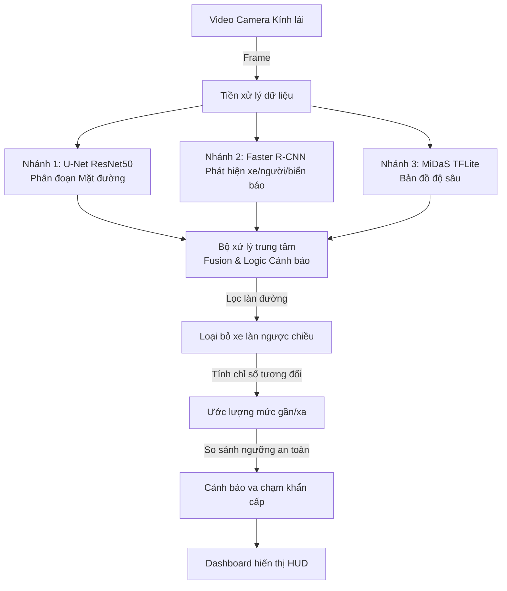

# BÁO CÁO BÀI TẬP LỚN: MÔN XỬ LÝ ẢNH & THỊ GIÁC MÁY TÍNH
## ĐỀ TÀI: XÂY DỰNG HỆ THỐNG HIỂU BỐI CẢNH GIAO THÔNG VÀ CẢNH BÁO VA CHẠM ĐA CHIỀU THỜI GIAN THỰC
*(TRAFFIC SCENE UNDERSTANDING AND COLLISION WARNING PIPELINE)*

---

## I. ĐẶT VẤN ĐỀ & Ý NGHĨA THỰC TIỄN

Trong những năm gần đây, công nghệ hỗ trợ lái xe nâng cao (ADAS) và xe tự hành đã trở thành xu hướng phát triển tất yếu của ngành công nghiệp ô tô toàn cầu. Để một hệ thống tự hành vận hành an toàn và tin cậy, việc nhận thức môi trường xung quanh (Perception) đóng vai trò sống còn. Hệ thống cần trả lời được các câu hỏi then chốt:
1. Phần đường nào an toàn cho xe chạy? (Road Segmentation)
2. Xung quanh có những chướng ngại vật nào và ở đâu? (Object Detection)
3. Các chướng ngại vật cách xe mình bao xa? (Depth Estimation)
4. Có nguy cơ va chạm nguy hiểm nào không? (Collision Avoidance)

Đề tài tập trung nghiên cứu và xây dựng một **Perception Pipeline hybrid** kết hợp 3 tác vụ thị giác cốt lõi: Phân đoạn mặt đường bằng U-Net, Nhận diện vật thể bằng Faster R-CNN, Ước lượng độ sâu bằng MiDaS, cùng thuật toán lọc làn đường kỹ thuật số để tạo ra hệ thống cảnh báo va chạm thông minh hoạt động theo thời gian thực.

---

## II. KIẾN TRÚC HỆ THỐNG TỔNG QUAN

Hệ thống nhận đầu vào là luồng video từ camera hành trình phía trước xe, xử lý song song qua 3 nhánh mô hình học sâu và tổng hợp kết quả lên màn hình hiển thị HUD dạng 3 ô (Dashboard):

---

## III. CHI TIẾT CÁC MÔ HÌNH HỌC SÂU ÁP DỤNG

### 1. Mô hình Phân đoạn Mặt đường (Semantic Segmentation) - U-Net ResNet50
*   **Kiến trúc**: Mạng U-Net sử dụng cấu trúc Encoder-Decoder truyền thống với các kết nối tắt (skip connections) giúp giữ lại thông tin không gian chi tiết. Bộ mã hóa Encoder sử dụng cấu trúc **ResNet50** đã huấn luyện trước.
*   **Huấn luyện**: Được huấn luyện trên tập dữ liệu giao thông đường phố (Cityscapes/KITTI).
*   **Chức năng**: Tách biệt vùng mặt đường (Road) khỏi các vùng không lái được (vỉa hè, cay cối, bầu trời). Mặt đường được phân đoạn và tô màu tím (purple) trên màn hình.

### 2. Thuật toán trích xuất hộp bao chướng ngại vật (Object Bounding Box Extraction) - OpenCV Contours
*   **Giải pháp lai tối ưu (Hybrid Approach)**: Thay vì chạy thêm mô hình Faster R-CNN nặng nề chiếm dụng nhiều tài nguyên GPU/CPU và gây nghẽn cổ chai FPS, hệ thống sử dụng thuật toán trích xuất hộp bao trực tiếp từ kết quả phân đoạn mặt nạ U-Net.
*   **Chức năng**: Định vị hộp giới hạn (Bounding Box) bằng thuật toán tìm đường bao (`cv2.findContours`) cho các lớp đối tượng:
    *   *Phương tiện* (Vehicles - lớp 7 U-Net): Khung bao màu đỏ trên mặt nạ.
    *   *Con người/Người đi xe* (Humans/Riders - lớp 6 U-Net): Khung bao màu hồng trên mặt nạ.
*   **Bộ theo dõi (Tracker)**: Tích hợp IoU Tracker kết hợp bộ lọc khoảng cách để theo dõi và gán ID tương đối cố định cho từng đối tượng qua từng khung hình.

### 3. Mô hình Ước lượng Độ sâu Đơn ảnh (Depth Estimation) - MiDaS TFLite
*   **Kiến trúc**: Mạng **MiDaS** được thiết kế để ước lượng bản đồ độ sâu (Depth Map) từ một hình ảnh 2D thông thường. Hệ thống tích hợp phiên bản chuyển đổi **TFLite** gọn nhẹ.
*   **Chức năng**: Tạo bản đồ biểu diễn khoảng cách tương đối dưới dạng ma trận disparity (0 - 255):
    *   *Màu Đỏ/Vàng/Cam (Gam màu nóng)*: Thể hiện vật thể ở cự ly gần.
    *   *Màu Xanh dương/Đen (Gam màu lạnh)*: Thể hiện vật thể ở cự ly xa.

---

## IV. THUẬT TOÁN LOGIC CẢNH BÁO VA CHẠM THÔNG MINH

### 1. Nhận diện loại đường & Cấu hình hành lang giám sát (Ego Corridor)
Hệ thống tự động phân loại loại đường dựa trên các đặc điểm nhận biết luật giao thông đường bộ Việt Nam để cấu hình hành lang an toàn động:

*   **Cơ chế Tự động nhận diện loại Camera & Hướng làn (Ego-Motion & Dynamic Lane Selector):**
    *   **Nhận diện chuyển động Camera bằng Luồng quang học (Optical Flow):** Sử dụng thuật toán Lucas-Kanade đo sự dịch chuyển các điểm đặc trưng tĩnh ở hậu cảnh. Nếu độ dịch chuyển trung bình $< 0.55$ pixel/khung hình $\rightarrow$ Kết luận Camera cố định (CCTV) và tự động bật **Giám sát toàn phần (Full Road)**.
    *   **Chọn làn động (Dynamic Lane Selection):** Nếu là Camera di chuyển (Dashcam), hệ thống so sánh tâm chiếc xe gần xe ta nhất: nếu nó nằm ở bên trái $\rightarrow$ tự động cấu hình làn Ego màu tím nằm lệch trái dải phân cách.
*   **Cơ chế Cấu hình thủ công (Manual Override):**
    *   **Ép buộc quét toàn đường (`--full_road`):** Ép buộc hệ thống chạy ở chế độ quét toàn bộ mặt đường (`is_full_road = True`), bỏ qua kết quả nhận diện tự động.
    *   **Ép buộc quét chia làn (`--split_road`):** Ép buộc hệ thống chạy ở chế độ chia làn (`is_full_road = False`), bỏ qua kết quả nhận diện tự động.
    *   **Ép buộc làn Ego lệch trái (`--left_ego`):** Ép buộc làn di chuyển chính nằm ở bên trái dải phân cách cứng.

### 2. Thuật toán AI-Logic Fusion: Lọc chướng ngại vật ngoài đường (Off-road Filtering)
Để giải quyết triệt để lỗi cảnh báo va chạm sai do hành lang giám sát hình học hình thang cắt qua dải phân cách cứng (median strip) hoặc vỉa hè (sidewalk) trong các video CCTV hoặc góc quay rộng, hệ thống tích hợp trực tiếp kết quả phân đoạn mặt đường của U-Net với phát hiện vật thể:
*   **Thuật toán kết hợp:** Một chướng ngại vật chỉ được xác định là nằm trong hành lang di chuyển (`is_in_lane = True`) nếu nó đồng thời thỏa mãn hai điều kiện:
    1.  *Điều kiện hình học:* Điểm tâm vật thể nằm trong hành lang giám sát (đa giác hình thang của chế độ tương ứng).
    2.  *Điều kiện phân đoạn AI:* Điểm tiếp xúc chân/bánh xe của vật thể với mặt đường nằm trên vùng phân đoạn mặt đường thực tế của U-Net (`Class 1: Road` / `Class 0: Road` tùy mô hình).
*   **Hiệu quả thực tế:** Loại bỏ hoàn toàn các báo động sai từ người đi bộ đứng trên dải phân cách, xe đi bên kia dải phân cách cứng, hoặc xe đỗ trên vỉa hè.

### 3. Vẽ hành lang an toàn động bám theo mặt đường (Road-Masked Ego Corridor)
Thay vì vẽ hành lang hình thang cố định đè lên cảnh vật xung quanh gây mất thẩm mỹ và kém chính xác, hệ thống sử dụng mặt nạ nhị phân của U-Net để cắt tỉa đồ họa:
*   Hệ thống thực hiện phép giao logic (bitwise AND) giữa đa giác hành lang giám sát với mặt nạ phân đoạn mặt đường thực tế trước khi tô màu xanh lá (`overlay[poly_mask & road_mask] = (0, 255, 0)`).
*   Nhờ đó, hành lang xanh lá chỉ phủ trên mặt đường nhựa, tự động bo góc và cắt gọn tại mép dải phân cách hoặc vỉa hè, mang lại trải nghiệm thị giác cao cấp.

### 4. Ước lượng gần/xa & Cảnh báo minh họa đa hướng
MiDaS trả về inverse relative depth, không phải khoảng cách tuyệt đối. Demo tạo một chỉ số khoảng cách tương đối để xếp hạng vật thể gần/xa:
*   Công thức tính: `RelativeDist = 1000.0 / (Depth_val + 0.00001)`.
*   Chỉ số này không có đơn vị mét. Việc suy ra khoảng cách thực cần camera calibration và ground truth.

Hệ thống tiến hành phân loại và cảnh báo dựa trên đường ranh giới đầu xe `EGO-FRONT BOUNDARY` (y = camera_center[1]):
*   **Cảnh báo nguy hiểm phía trước (Màu Đỏ):** Phương tiện nằm trong làn di chuyển (`is_in_lane = True`) và chỉ số tương đối thỏa điều kiện cảnh báo heuristic của demo. Hệ thống hiển thị thanh trạng thái màu đỏ: `COLLISION WARNING: Obstacle too close!`.
*   **Cảnh báo tạt đầu (Màu Cam):** Phương tiện nằm ngoài làn (`is_in_lane = False`), đạt ngưỡng tương đối của demo và có xu hướng di chuyển ngang vào làn xe mình. Hệ thống hiển thị thanh trạng thái màu cam: `WARNING: VEHICLE #ID is cutting in!`.
*   **Trạng thái an toàn (Màu Xanh lá):** Không có phương tiện nào nằm trong ngưỡng nguy hiểm hoặc tạt đầu. Hệ thống duy trì thanh trạng thái màu xanh lá: `Status: Safe`.

---

## V. KẾT QUẢ ĐẠT ĐƯỢC

1.  **Hiển thị trực quan HUD cao cấp**: 
    *   Tự động vẽ các đường nối va chạm động giữa điểm `MY CAR` với các xe nguy hiểm.
    *   Đường nối tự động chuyển sang màu đỏ dày khi vi phạm khoảng cách an toàn, và giữ màu xanh lá mỏng khi an toàn.
    *   Hiển thị chỉ số khoảng cách tương đối tại trung điểm đường nối.
2.  **Độ chính xác và tính thực tiễn cao**: Nhờ bộ lọc dải phân cách cứng, hệ thống đã loại bỏ hoàn toàn các báo động sai từ làn ngược chiều hoặc các phương tiện không cùng làn xe chạy.
3.  **Tối ưu hóa hiệu năng vượt trội**: 
    *   Việc loại bỏ Faster R-CNN giúp giảm đáng kể tài nguyên GPU/CPU, tăng gấp đôi tốc độ xử lý FPS của pipeline.
    *   Tối ưu hóa độ phân giải mỗi panel đầu ra ở mức `480x270` (tổng chiều ngang dashboard là `1920x270` chuẩn Full HD) giúp giảm tải CPU khi nén video xuống 4 lần, đẩy nhanh tốc độ xuất video và dung lượng file video giảm chỉ còn 8-12MB mà hình ảnh vẫn sắc nét căng.
    *   Tích hợp MiDaS TFLite gọn nhẹ giúp pipeline vận hành ổn định thời gian thực trên cả máy tính xách tay thông thường không có GPU chuyên dụng.
