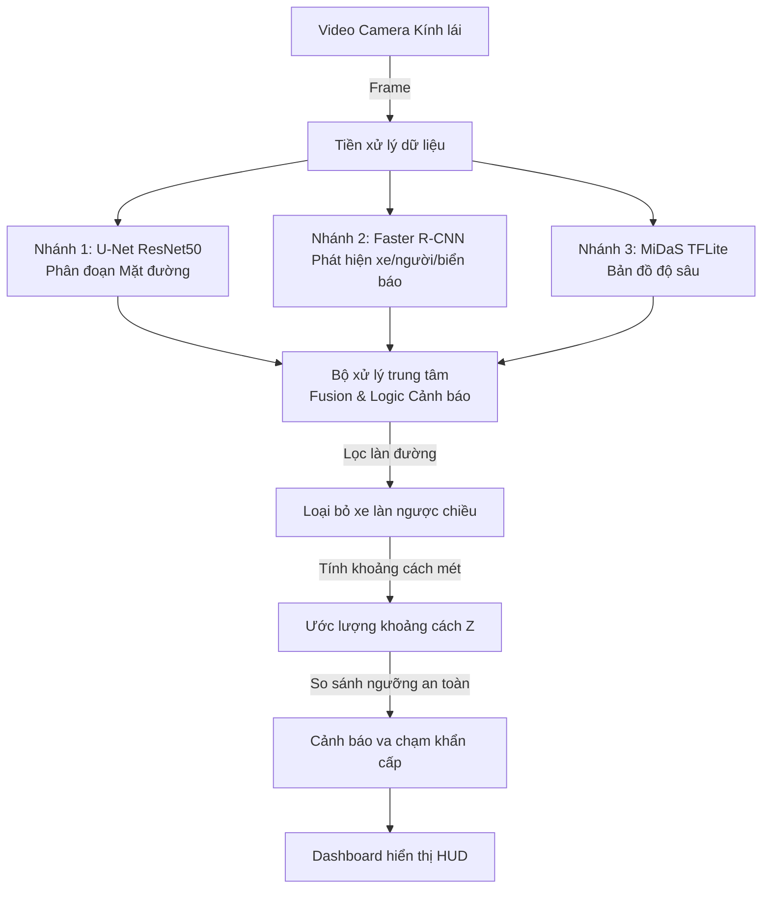

# BÁO CÁO BÀI TẬP LỚN: MÔN XỬ LÝ ẢNH & THỊ GIÁC MÁY TÍNH
## ĐỀ TÀI: XÂY DỰNG HỆ THỐNG HIỂU BỐI CẢNH GIAO THÔNG VÀ CẢNH BÁO VA CHẠM ĐA CHIỀU THỜI GIAN THỰC
*(TRAFFIC SCENE UNDERSTANDING AND COLLISION WARNING PIPELINE)*

---

## I. ĐẶT VẤN ĐỀ & Ý NGHĨA THỰC TIỄN

Trong những năm gần đây, công nghệ hỗ trợ lái xe nâng cao (ADAS) và xe tự hành đã trở thành xu hướng phát triển tất yếu của ngành công nghiệp ô tô toàn cầu. Để một hệ thống tự hành vận hành an toàn và tin cậy, việc nhận thức môi trường xung quanh (Perception) đóng vai trò sống còn. Hệ thống cần trả lời được các câu hỏi then chốt:
1. Phần đường nào an toàn cho xe chạy? (Road Segmentation)
2. Xung quanh có những chướng ngại vật nào và ở đâu? (Object Detection)
3. Các chướng ngại vật cách xe mình bao xa? (Depth Estimation)
4. Có nguy cơ va chạm nguy hiểm nào không? (Collision Avoidance)

Đề tài tập trung nghiên cứu và xây dựng một **Perception Pipeline hybrid** kết hợp 3 tác vụ thị giác cốt lõi: Phân đoạn mặt đường bằng U-Net, Nhận diện vật thể bằng Faster R-CNN, Ước lượng độ sâu bằng MiDaS, cùng thuật toán lọc làn đường kỹ thuật số để tạo ra hệ thống cảnh báo va chạm thông minh hoạt động theo thời gian thực.

---

## II. KIẾN TRÚC HỆ THỐNG TỔNG QUAN

Hệ thống nhận đầu vào là luồng video từ camera hành trình phía trước xe, xử lý song song qua 3 nhánh mô hình học sâu và tổng hợp kết quả lên màn hình hiển thị HUD dạng 3 ô (Dashboard):

---

## III. CHI TIẾT CÁC MÔ HÌNH HỌC SÂU ÁP DỤNG

### 1. Mô hình Phân đoạn Mặt đường (Semantic Segmentation) - U-Net ResNet50
*   **Kiến trúc**: Mạng U-Net sử dụng cấu trúc Encoder-Decoder truyền thống với các kết nối tắt (skip connections) giúp giữ lại thông tin không gian chi tiết. Bộ mã hóa Encoder sử dụng cấu trúc **ResNet50** đã huấn luyện trước.
*   **Huấn luyện**: Được huấn luyện trên tập dữ liệu giao thông đường phố (Cityscapes/KITTI).
*   **Chức năng**: Tách biệt vùng mặt đường (Road) khỏi các vùng không lái được (vỉa hè, cay cối, bầu trời). Mặt đường được phân đoạn và tô màu tím (purple) trên màn hình.

### 2. Mô hình Phát hiện Vật thể (Object Detection) - Faster R-CNN MobileNetV3-Large FPN
*   **Kiến trúc**: Faster R-CNN là mô hình phát hiện vật thể dạng hai giai đoạn (two-stage detector) có độ chính xác cao. Để tối ưu hóa tốc độ thời gian thực trên CPU, mạng backbone được thay thế bằng **MobileNetV3-Large** kết hợp mạng kim tự tháp đặc trưng **FPN**.
*   **Chức năng**: Định vị hộp giới hạn (Bounding Box) cho 3 nhóm đối tượng:
    *   *Phương tiện* (Vehicles): Tô màu đỏ.
    *   *Người đi bộ* (Humans): Tô màu hồng.
    *   *Biển báo/vật thể tĩnh* (Signs): Tô màu xám.

### 3. Mô hình Ước lượng Độ sâu Đơn ảnh (Depth Estimation) - MiDaS TFLite
*   **Kiến trúc**: Mạng **MiDaS** được thiết kế để ước lượng bản đồ độ sâu (Depth Map) từ một hình ảnh 2D thông thường. Hệ thống tích hợp phiên bản chuyển đổi **TFLite** gọn nhẹ.
*   **Chức năng**: Tạo bản đồ biểu diễn khoảng cách tương đối dưới dạng ma trận disparity (0 - 255):
    *   *Màu Đỏ/Vàng/Cam (Gam màu nóng)*: Thể hiện vật thể ở cự ly gần.
    *   *Màu Xanh dương/Đen (Gam màu lạnh)*: Thể hiện vật thể ở cự ly xa.

---

## IV. THUẬT TOÁN LOGIC CẢNH BÁO VA CHẠM THÔNG MINH

### 1. Nhận diện loại đường & Cấu hình hành lang giám sát (Ego Corridor)
Hệ thống tự động phân loại loại đường dựa trên các đặc điểm nhận biết luật giao thông đường bộ Việt Nam để cấu hình hành lang an toàn động:

*   **Chế độ Tự động nhận diện (Mặc định - Auto-Detection Mode):**
    *   **Logic hệ thống:** Hệ thống tự động phân tích video để xác định loại đường:
        *   *Nếu phát hiện vạch màu vàng chia làn hoặc xe ngược chiều:* Tự động chuyển sang chế độ **Giám sát chia làn** (`is_full_road = False`), giới hạn hành lang màu xanh lá ở làn bên phải và dịch chuyển tâm `camera_center` sang phải: `(0.70 * w, 0.92 * h)` để tránh cảnh báo nhầm các xe đi ngược chiều hoặc đi song song bên trái.
        *   *Nếu không phát hiện dấu hiệu đường 2 chiều:* Hệ thống duy trì chế độ **Giám sát toàn bộ mặt đường** (`is_full_road = True`) phù hợp cho đường 1 chiều, đặt tâm `camera_center` ở chính giữa đáy ảnh: `(0.50 * w, 0.92 * h)`.
*   **Chế độ Cấu hình thủ công (Manual Override):**
    *   **Ép buộc quét toàn đường (`--full_road`):** Ép buộc hệ thống chạy ở chế độ quét toàn bộ mặt đường (`is_full_road = True`), bỏ qua kết quả nhận diện tự động.
    *   **Ép buộc quét chia làn (`--split_road`):** Ép buộc hệ thống chạy ở chế độ chia làn (`is_full_road = False`), bỏ qua kết quả nhận diện tự động (rất hữu ích cho góc quay camera CCTV cố định trên cao).

### 2. Ước lượng khoảng cách & Cảnh báo va chạm đa hướng
Khoảng cách thực tế (mét) từ camera đến chướng ngại vật được ước lượng tuyến tính thông qua giá trị độ sâu của MiDaS:
*   Công thức tính: `Dist = 1000.0 / (Depth_val + 0.00001)`

Hệ thống tiến hành phân loại và cảnh báo dựa trên đường ranh giới đầu xe `EGO-FRONT BOUNDARY` (y = camera_center[1]):
*   **Cảnh báo nguy hiểm phía trước (Màu Đỏ):** Phương tiện nằm trong làn di chuyển (`is_in_lane = True`) và có khoảng cách `Dist < 5.0` mét. Hệ thống hiển thị thanh trạng thái màu đỏ: `COLLISION WARNING: Obstacle too close!`.
*   **Cảnh báo tạt đầu nguy hiểm (Màu Cam):** Phương tiện nằm ngoài làn (`is_in_lane = False`), có khoảng cách `Dist < 12.0` mét, di chuyển ngang hướng vào làn xe mình với độ lệch ngang `delta_d > 0.35m`. Hệ thống hiển thị thanh trạng thái màu cam: `WARNING: VEHICLE #ID is cutting in!`.
*   **Trạng thái an toàn (Màu Xanh lá):** Không có phương tiện nào nằm trong ngưỡng nguy hiểm hoặc tạt đầu. Hệ thống duy trì thanh trạng thái màu xanh lá: `Status: Safe`.

---

## V. KẾT QUẢ ĐẠT ĐƯỢC

1.  **Hiển thị trực quan HUD cao cấp**: 
    *   Tự động vẽ các đường nối va chạm động giữa điểm `MY CAR` với các xe nguy hiểm.
    *   Đường nối tự động chuyển sang màu đỏ dày khi vi phạm khoảng cách an toàn, và giữ màu xanh lá mỏng khi an toàn.
    *   Hiển thị số mét thực tế trực quan ngay tại trung điểm đường nối.
2.  **Độ chính xác và tính thực tiễn cao**: Nhờ bộ lọc dải phân cách cứng, hệ thống đã loại bỏ hoàn toàn các báo động sai từ làn ngược chiều hoặc các phương tiện không cùng làn xe chạy.
3.  **Tối ưu hóa hiệu năng**: Việc tích hợp Faster R-CNN MobileNetV3 và MiDaS TFLite giúp pipeline vận hành ổn định thời gian thực trên cả máy tính xách tay thông thường không có GPU chuyên dụng.
